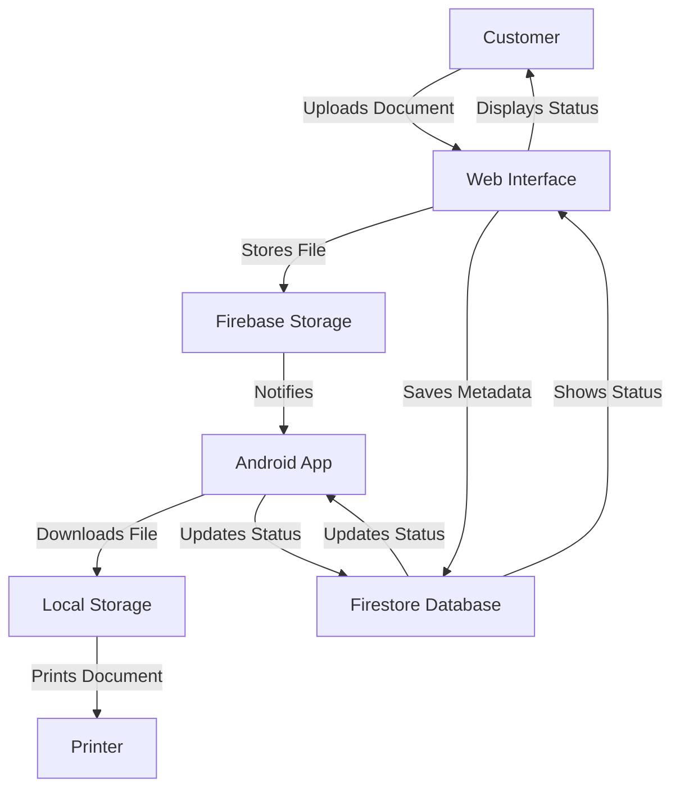

# PrintEasy - System Architecture and Workflow

## System Overview
PrintEasy is an automated document printing solution that connects customers with merchants through a web interface and Android application. The system uses Firebase for real-time communication, storage, and database management.

## Architecture Components

### 1. Web Application (Next.js)
- **Frontend Features:**
  - User-friendly document upload interface
  - Real-time upload progress tracking
  - Responsive design with Tailwind CSS
  - TypeScript implementation for type safety

### 2. Backend (Firebase)
- **Storage:**
  - Firebase Storage for document storage
  - Automatic file cleanup after 30 minutes
- **Database:**
  - Firestore for metadata storage
  - Real-time updates and synchronization

### 3. Android Application (Kotlin)
- **Core Features:**
  - Background document monitoring
  - Automatic file download
  - Instant printing capability
  - Error handling and status updates

## System Workflow

## Detailed Process Flow

1. **Customer Upload Process**
   - Customer visits merchant's web portal
   - Selects document for upload
   - System validates file type and size
   - Real-time progress tracking
   - Automatic metadata extraction

2. **Backend Processing**
   - File storage in Firebase Storage
   - Metadata logging in Firestore
   - Real-time status updates
   - Automatic file cleanup after 30 minutes

3. **Merchant Printing Process**
   - Android app monitors for new documents
   - Automatic file download
   - Print job queuing
   - Status updates to database
   - Optional file cleanup after printing

## Technical Specifications

### Web Application
- **Framework:** Next.js 14
- **Language:** TypeScript
- **Styling:** Tailwind CSS
- **Key Libraries:**
  - Firebase Web SDK
  - React
  - Next.js App Router

### Android Application
- **Language:** Kotlin
- **Key Components:**
  - Firebase Android SDK
  - Android Printing Framework
  - Coroutines for async operations
  - Background Services

### Firebase Integration
- **Storage:** Document file storage
- **Firestore:** Real-time status updates
- **Authentication:** (Future implementation)
- **Cloud Functions:** (Future implementation)

## Security Features
- Secure file upload process
- Temporary file storage
- Automatic file cleanup
- Future implementation of user authentication

## Future Enhancements
1. User authentication system
2. Print job customization options
3. Payment integration
4. Merchant dashboard
5. Print history and analytics
6. Multiple printer support
7. Print job scheduling

## Error Handling
- File upload failures
- Network connectivity issues
- Printer errors
- Storage quota management
- Invalid file type handling

## Performance Considerations
- Optimized file upload process
- Efficient background monitoring
- Minimal resource usage
- Quick print job processing
- Real-time status updates
